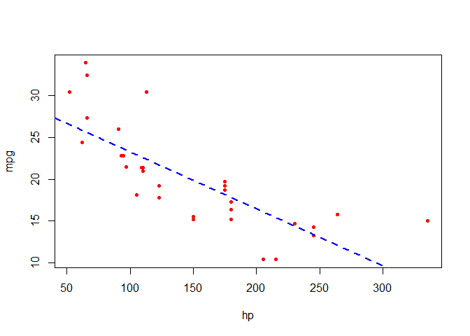

Test drive R Markdown
================
Lulus
6/18/2021

Learning patiently will be the key in this process.

``` r
data("mtcars")
attach(mtcars)
plot(mpg~hp, pch=20, col="red")
abline(lm(mpg~hp), lty=2, lwd=2, col="blue")
```

<!-- -->

Here is the final result we have got over this project. Was such a fun
at the end of the day.
